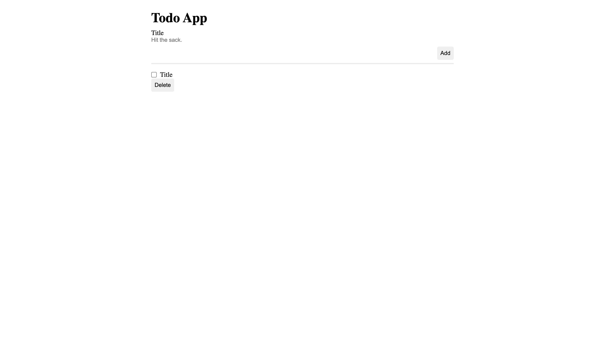
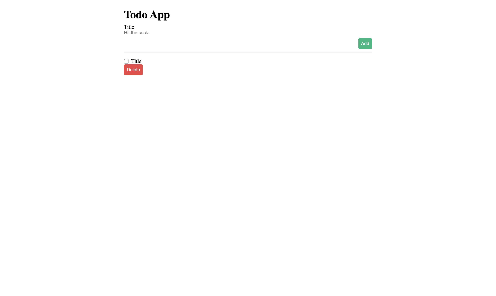
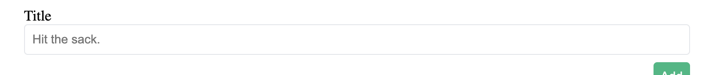
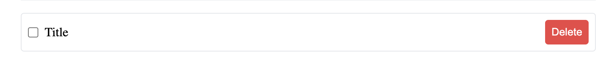
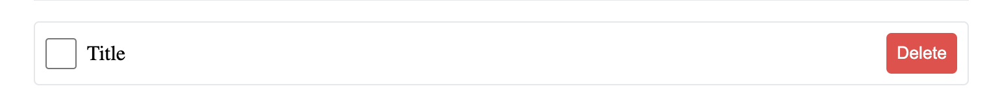

# Day 1 - Exercise 1

## Exercise 1.1
ให้น้อง ๆ ปรับขนาด Class `App` ให้มีขนาดเป็น ครึ่งหนึ่งของ Parent Element

## Exercise 1.2
ให้น้อง ๆ ปรับสีพื้นหลัง และ สีตัวอักษร ให้ปุ่ม Add และ Delete และให้เปลี่ยนสีเมื่อนำ Mouse ไปชี้

## Exercise 1.3
ให้น้อง ๆ ปรับแต่ง CSS ใน Class `textField` ให้เหมือนกับภาพตัวอย่างข้างล่าง
> Hint : Padding, Border

## Exercise 1.4
ให้น้อง ๆ ปรับแต่ง CSS ใน Class `todo` ให้เหมือนกับภาพตัวอย่างข้างล่าง
> Hint : Flex box

## Exercise 1.5
ให้น้อง ๆ ช่วยปรับขนาด Check box ที่อยู่ใน todo ให้มีขนาดที่เหมาะสม

