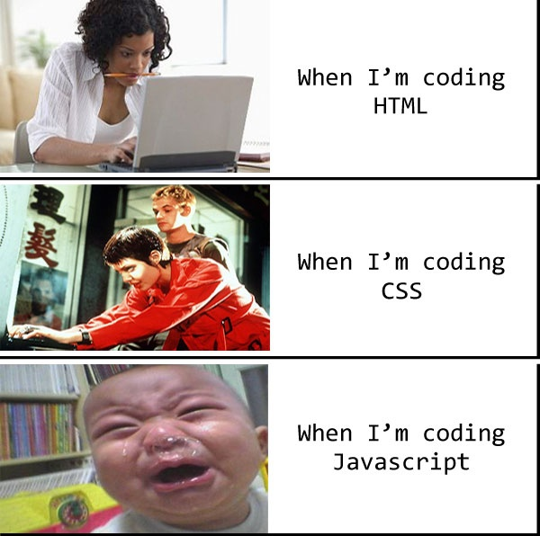

# Day 1 - Exercise 2

## Exercise 2.1
ให้น้อง ๆ แก้ไขไฟล์ `script.js` ให้สามารถทำงานได้ตามที่โจทย์กำหนด โดยภายในโจทย์จะมีการเขียนกำกับไว้ให้แล้ว ว่าต้องแก้จุดใดบ้าง
น้อง ๆ สามารถสังเกตได้จาก `@description`

## Exercise 2.2
ให้น้อง ๆ นำ Array `todos` ไปเก็บใน `LocalStorage` และ เมื่อเข้าเว็บครั้งแรกให้ทำข้อมูลจาก `LocalStorage` มาใส่ใน `todos`

### TIPS
`localStorage.setItem('myCat', 'Tom');` - ตั้งชื่อ Key ว่า myCat และ Value เป็น 'Tom'

`localStorage.setItem('myCat', JSON.stringify({...}));` - ตั้งชื่อ Key ว่า myCat และ Value เป็น Object

`localStorage.setItem('myCat', JSON.stringify([...]));` - ตั้งชื่อ Key ว่า myCat และ Value เป็น Array

`localStorage.getItem('myCat');` - ใช้เพื่อดึงค่ามาจาก localStorage โดยใช้ key ที่ชื่อว่า myCat

`localStorage.removeItem('myCat');` - ลบข้อมูลออกจาก localStorage โดยใช้ Key ที่ชื่อว่า myCat

`JSON.parse('{name: "HeartSite"}')` - แปลงข้อความให้ออกมาเป็นในรูปแบบ Object 

